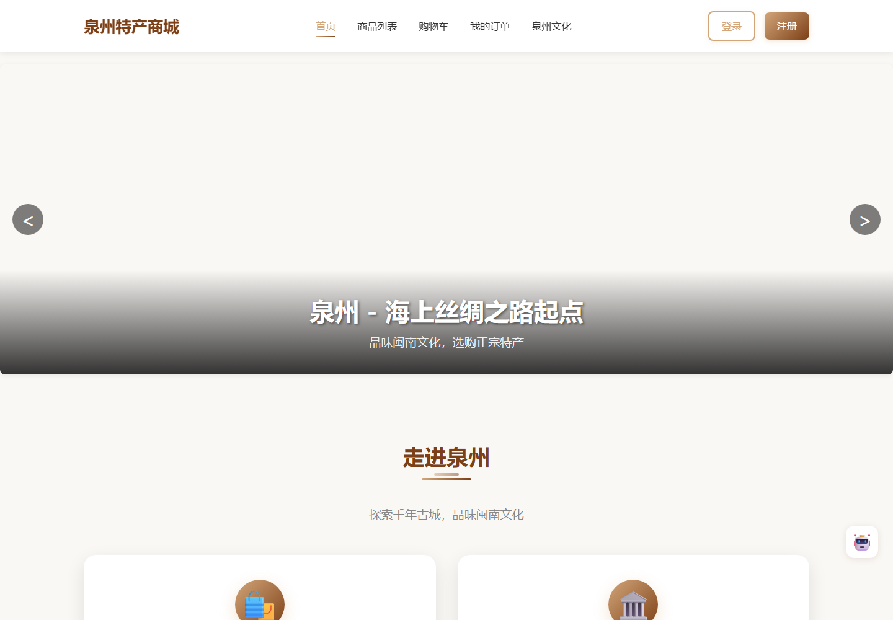
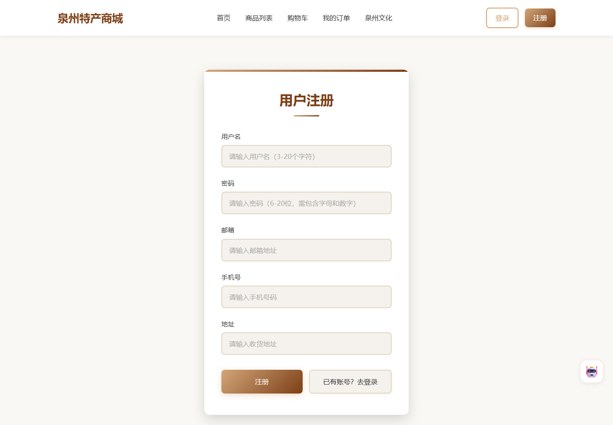
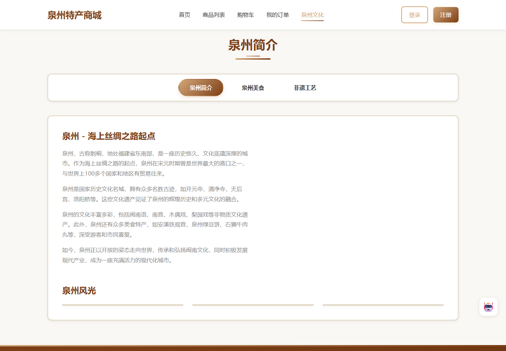

# 泉州特产商城

一个基于 Spring Boot 与 Vue 2 的前后端分离 Java Web 项目，覆盖商品、购物车、订单、评价、售后、人工客服和 Ollama AI 客服等功能。

> 项目定位为单体学习与作品集项目。当前未使用 Redis、MQ、分布式 WebSocket、RAG 或真实支付网关，也不宣称具备高并发商城能力。

## 项目预览

以下截图仅展示脱敏后的公开页面，不包含真实用户、订单、聊天记录或本地商品图片。

### 用户端首页



### 用户注册



### 泉州文化展示



## 技术栈

### 后端

- Java 8
- Spring Boot 2.7.18 / Spring MVC
- Spring WebSocket
- MyBatis-Plus 3.5.3.1
- MySQL 8
- JJWT 0.11.5
- BCrypt
- Maven

### 前端

- Vue 2.7
- Vue Router / Vuex
- Element UI
- Axios
- WebSocket API

## 已实现功能

- 用户与管理员分表登录，JWT 中使用 `type=user/admin` 区分身份。
- 商品分类、搜索、分页、详情、推荐及管理端上下架。
- 持久化购物车，按用户绑定并合并重复商品。
- 订单主表/明细表，支持创建、模拟支付、取消、发货与确认收货的基础状态流转。
- 售后申请、审核、填写退货物流、商家收货和退款流程。
- 商品评价、图片评价、匿名评价、商家回复和敏感词替换。

## 实时人工客服

`/ws/chat` 使用 JWT 完成 WebSocket 握手鉴权。服务端使用 `ConcurrentHashMap` 保存用户连接，使用 `CopyOnWriteArraySet` 保存在线管理员连接。

已实现：

- 按当前登录身份和会话归属向对应用户定向推送。
- 在线管理员接收会话和消息更新。
- 会话与聊天消息持久化保存。
- 历史消息、未读数量、已读标记、会话备注与状态管理。
- 同一用户建立新连接时关闭旧连接，避免多标签页重复收消息。
- 使用 Spring `ThreadPoolTaskExecutor` 执行客服自动回复任务。

当前 WebSocket Session 保存在单个 JVM 内，因此本实现面向单实例部署，不是分布式 WebSocket 方案。

## Ollama AI 客服

`/ws/ai-chat` 接收用户消息，后端通过 `RestTemplate` 调用本地 Ollama `/api/chat` 接口。

- 默认模型为 `deepseek-r1:1.5b`，可通过配置替换。
- 在请求中加入商城导购 System Prompt。
- 读取最近 20 条历史消息构建多轮上下文。
- 用户消息与 AI 回复都会持久化。
- Ollama 连接失败或超时时，返回“AI 导购暂时繁忙”的降级提示。

AI 客服当前没有连接商品、库存或订单查询工具，不是 RAG 或业务数据问答系统。

## 项目结构

```text
.
├── springboot-backend/             # Spring Boot 后端
│   ├── src/main/java/com/quanzhou/mall
│   │   ├── controller
│   │   ├── service
│   │   ├── mapper
│   │   ├── websocket
│   │   └── config
│   └── src/main/resources
└── vue/                            # Vue 2 前端
    └── src
        ├── api
        ├── router
        ├── store
        └── views
```

## 本地运行

### 1. 准备环境

- JDK 8+
- MySQL 8
- Node.js 16+ 与 npm
- Ollama（仅 AI 客服需要）

### 2. 准备数据库

本仓库不公开数据库 SQL、完整表结构或初始化数据。请在本地自行准备与代码实体及持久层映射相匹配的 MySQL 数据库，并为管理员密码使用 BCrypt 哈希，不要设置公开默认密码。

### 3. 配置后端

推荐使用环境变量：

```powershell
$env:DB_URL = "jdbc:mysql://localhost:3306/quanzhou_mall?useUnicode=true&characterEncoding=UTF-8&serverTimezone=Asia/Shanghai&useSSL=false"
$env:DB_USERNAME = "root"
$env:DB_PASSWORD = "your-local-password"
$env:JWT_SECRET = "replace-with-a-random-secret-at-least-32-bytes"
```

也可复制 `springboot-backend/src/main/resources/application-local.example.properties` 为未跟踪的 `application-local.properties`，然后使用 `local` profile 启动。

```powershell
cd springboot-backend
..\mvnw.cmd spring-boot:run
```

如果使用 `application-local.properties`，启动命令为 `..\mvnw.cmd spring-boot:run -Dspring-boot.run.profiles=local`。

后端默认访问地址：`http://localhost:8088`。

### 4. 配置 Ollama（可选）

```powershell
ollama pull deepseek-r1:1.5b
```

可使用 `OLLAMA_BASE_URL` 和 `OLLAMA_MODEL` 覆盖默认值。不启动 Ollama 时，其他商城功能仍可使用，AI 客服会返回降级提示。

### 5. 启动前端

```powershell
cd vue
npm install
npm run serve
```

前端默认访问地址：`http://localhost:3000`。开发服务器会将 `/api` 代理到 `http://localhost:8088`。

## 安全说明

- 本地数据库密码和 JWT Secret 不在仓库中保存。
- 用户和管理员密码字段不会通过 JSON 接口返回。
- 订单、购物车、售后和客服历史接口会校验当前用户与资源的归属关系。
- WebSocket 的浏览器原生 API 无法自定义 `Authorization` 请求头，当前通过 query parameter 在握手时传递 JWT。生产环境应使用 HTTPS/WSS，并确保代理和访问日志不记录完整 query string。
- CORS 和 WebSocket Origin 默认只允许 `http://localhost:3000`，部署时通过 `APP_CORS_ALLOWED_ORIGINS` 指定前端域名。

## 已知边界

- 支付为订单状态模拟，没有接入真实支付平台。
- 当前没有 Redis、MQ、分布式锁和库存防超卖方案。
- 订单创建尚未建立完整的库存扣减/回滚与事务边界。
- WebSocket 连接状态保存在单机内存。
- AI 客服与人工客服为独立会话，没有实现自动会话转接。
- 当前仓库尚未包含自动化测试、Docker 或 Nginx 部署配置。
